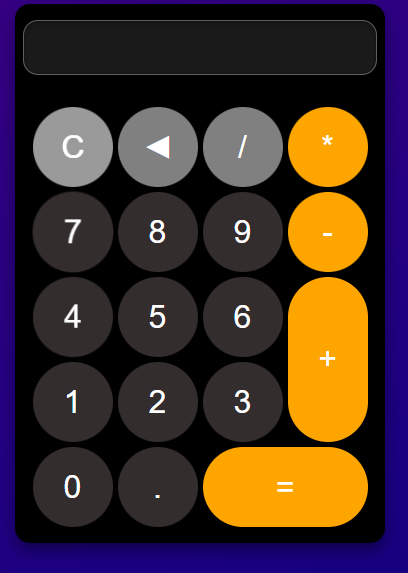
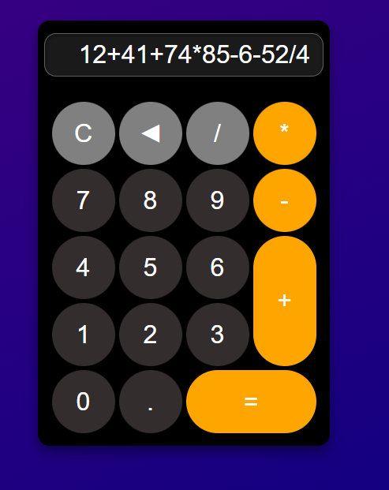
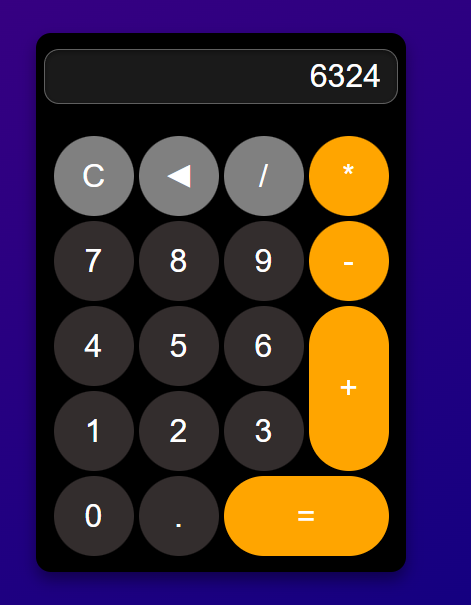

# 🧮 React Calculator  

A **React.js-based** calculator with a **modern, dynamic interface** and robust **input validation** to ensure accurate calculations. The application is designed for seamless user interaction, supporting both **mouse clicks and keyboard input** with custom key bindings.  

## 🎯 Features  

- **Real-time State Management** – React state efficiently tracks inputs and results.  
- **Keyboard Support** – Custom key bindings for a smooth user experience.  
- **Error Prevention** – Guards against invalid expressions to prevent calculation errors.  
- **Grid-Based Layout** – Ensures an intuitive and visually structured design.  
- **Responsive & Accessible** – Optimized for all screen sizes and assistive technologies.  

## 🛠️ Technologies Used  

- **React.js** – Core framework for building UI components.  
- **CSS** – Styling for a modern, responsive design.  

## 📸 Screenshots  

### Homepage  


### Equation
  

### Result
  

## 🚀 Installation & Setup  

1. Clone the repository:  
   ```bash
   git clone https://github.com/vladig98/Calculator-React.js.git
   cd Calculator-React.js
   ```  
2. Install dependencies:  
   ```bash
   npm install
   ```
3. Build the app
   ```bash
   npm run build
   ```
4. Start the development server:  
   ```bash
   npm run preview
   ```  

## 🎮 How to Use  

- Click the **buttons** or use the **keyboard** for input.  
- Supports **basic arithmetic operations** (`+`, `-`, `*`, `/`).  
- Press **Enter** (`=`) to calculate the result.  
- Use **Backspace/Delete** to remove the last input.  
- Press **C** or the **Clear button** to reset the calculator.  

## 🛠️ Contributing  

Contributions are welcome! Feel free to **fork** the repository, create a **new branch**, and submit a **pull request**.  

## 📄 License  

This project is licensed under the **MIT License**.  

---

**🧮 Try it out and make calculations easier with this React-powered calculator! 🚀**  